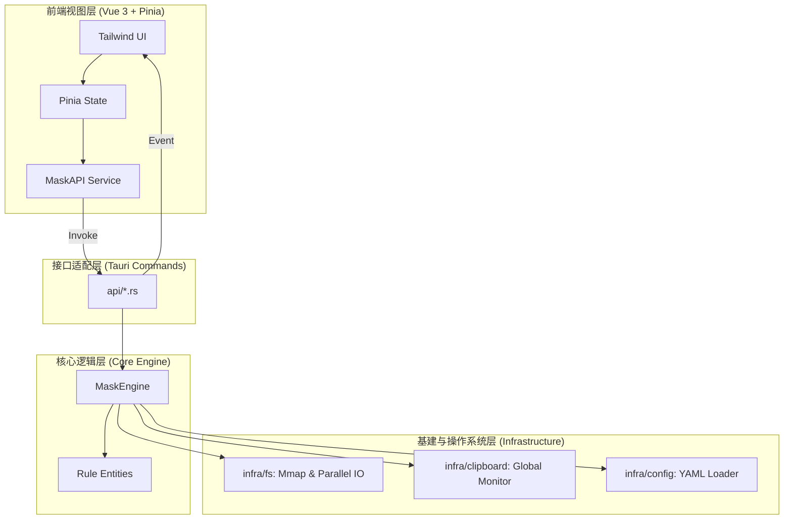

# 🛡️ SafeMask 架构详解 (Part 1: 设计哲学与分层体系)

SafeMask 不仅仅是一个正则表达式替换工具，它是一个旨在解决 **“AI 时代隐私数据不出域”** 的工业级脱敏引擎。其核心设计目标是：**极致性能 (Performance)**、**AI 友好 (AI-Friendly)** 和 **绝对安全 (Zero-Trust)**。

## 1. 设计哲学 (Design Philosophy)

*   **脱敏而非校验**：不同于常规的正则校验，SafeMask 遵循“宁可错杀，不可漏过”的原则。引擎优化更倾向于快速覆盖大范围疑似隐私项，而非进行复杂的逻辑验证。
*   **语义化脱敏 (AI-Friendly)**：传统的 `***` 替换会破坏 LLM（大语言模型）的推理逻辑。SafeMask 将敏感信息转换为带有语义的标签（如 `<POSTGRES_URI>`），使 AI 能够在不接触真实数据的前提下理解上下文逻辑。
*   **计算重叠 (I/O Overlapping)**：通过 Rust 的异步与多线程机制，实现“读取-脱敏-写入”三阶段的完全并行，使性能瓶颈仅取决于磁盘 I/O 上限。

## 2. 系统分层架构 (Layered Architecture)

SafeMask 采用典型的“核心-基建-接口”分层模式，确保了业务逻辑与操作系统底层的解耦。

### 各层职责说明：
1.  **UI 表现层**：基于 Vue 3 组合式 API 打造。负责处理大文件拖拽事件、展示实时脱敏进度以及规则的可视化管理。
2.  **接口适配层 (Tauri Commands)**：作为 Rust 与 TS 的桥梁，处理参数序列化、权限校验，并利用 Tauri 的 `Emitter` 向前端推送非阻塞的进度事件。
3.  **核心逻辑层 (Core)**：**纯 Rust 实现**。这是 SafeMask 的心脏，包含混合引擎（AC 自动机 + 字节正则）的编译与执行逻辑，完全不依赖 UI 框架。
4.  **基建层 (Infra)**：负责所有昂贵的系统级操作。包括内存映射文件处理、跨平台剪贴板监听、以及 YAML 格式规则的解析与持久化。

---

## 3. 技术栈选型 (Technology Stack)

| 维度 | 选型 | 理由 |
| :--- | :--- | :--- |
| **运行时支撑** | Tauri v2 | 相比 Electron 减少 90% 内存占用，利用 Rust 保证后端安全。 |
| **内存分配器** | `mimalloc` | 在高并发字符串处理中表现优于默认分配器，减少碎片。 |
| **并发模型** | `Rayon` | 自动任务窃取算法，充分压榨多核 CPU 处理文本块。 |
| **正则引擎** | `regex::bytes` | 跳过 UTF-8 校验，直接在原生字节流上操作，速度极快。 |
| **高速匹配** | `aho-corasick` | 针对固定词（如人名、项目名）提供 $O(n)$ 时间复杂度的匹配。 |

