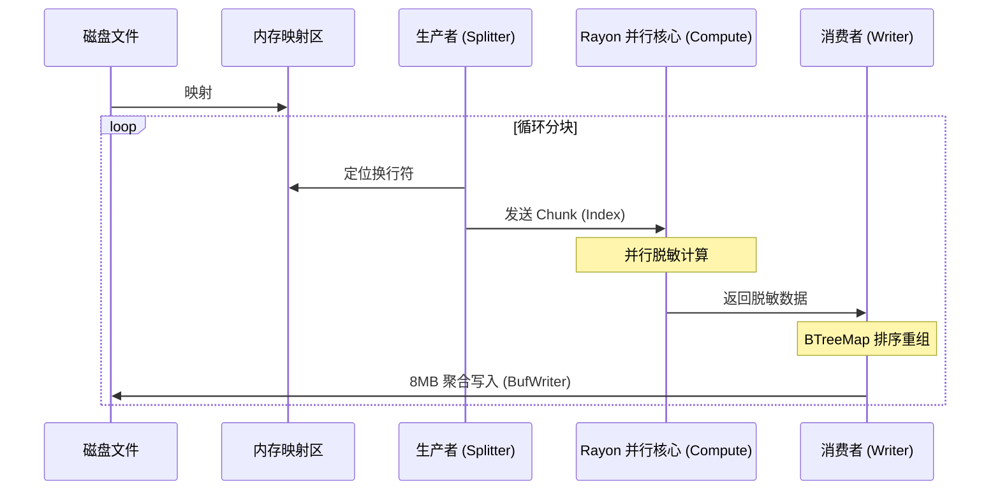

# 🛡️ SafeMask 架构详解 (Part 3: 高并发保序流水线与 I/O 优化)

对于 GB 级别的日志文件，传统的“逐行读取 -> 处理 -> 逐行写入”模式会因为频繁的系统调用和 I/O 阻塞导致性能急剧下降。SafeMask 在 `src-tauri/src/infra/fs/processor.rs` 中实现了一套工业级的**高并发保序处理流水线**。

---

## 1. 核心黑科技：内存映射 (Mmap)

SafeMask 抛弃了传统的 `Read` 调用，采用了 `memmap2` 库。
*   **原理**：将磁盘文件直接映射到进程的虚拟地址空间。
*   **优势**：
    *   **零拷贝 (Zero-copy)**：数据直接由内核空间映射到用户空间，减少了一次昂贵的内存拷贝。
    *   **由 OS 调度**：利用操作系统的页缓存（Page Cache）机制，自动处理预读和缓存置换。
    *   **随机访问**：并行处理时，多线程可以同时读取映射区域的不同部分，互不干扰。

---

## 2. 三阶段并行流水线 (The Pipeline)

为了压榨多核 CPU 性能并保证输出顺序，SafeMask 设计了三阶段异步流水线：

### 第一阶段：智能宏分块 (Producer & Splitter)
*   **逻辑**：由 `SplitLinesIterator` 将 Mmap 后的字节流切割为固定大小（默认 8MB）的 **Chunk**。
*   **难点**：切割时不能简单按字节切断，必须寻找最近的 `\n` 换行符，确保每个 Chunk 包含完整的行。

### 第二阶段：并行脱敏集群 (Compute Cluster)
*   **逻辑**：利用 `Rayon` 的任务窃取并行框架（Work-stealing）。
*   **处理**：多个 CPU 核心同时对不同的 8MB Chunk 进行脱敏计算。这是计算密集型阶段，通过 `MaskEngine` 完成字节级匹配。

### 第三阶段：保序重组写入 (Ordered Consumer)
*   **逻辑**：并行处理会导致“先读取的块可能后处理完”。
*   **算法**：
    1.  每个块被分配一个唯一的序号（Index）。
    2.  写入线程维护一个 `BTreeMap` 缓冲区和一个预期序号计数器（`next_idx`）。
    3.  即使块 5 先处理完，它也会被暂存在内存中，直到块 0-4 全部写入磁盘，确保**输出文件与输入文件的行序 100% 一致**。

---

## 3. 背压控制与内存防御 (Backpressure)

在高并发场景下，如果读取速度远快于磁盘写入速度，内存会被大量积压的处理结果撑爆（OOM）。

SafeMask 通过 `crossbeam-channel` 实现了**背压机制**：
*   **受限容量**：设置 `MAX_IN_FLIGHT = 32`。这意味着内存中最多只能积压 32 个处理中的块（约 256MB）。
*   **阻塞控制**：当缓冲区满时，生产者（读取线程）会自动阻塞，等待写入线程消耗掉旧块，从而将内存占用稳定在极低水平。

---

## 4. 架构逻辑示意图

---

## 5. 性能指标总结

得益于这套架构，SafeMask 在处理 2.3GB 日志时：
*   **吞吐量**：稳定在 **300MB/s - 340MB/s**（接近普通 SSD 的顺序写入上限）。
*   **内存占用**：始终保持在 **300MB 左右**，无论输入文件是 100MB 还是 100GB。
